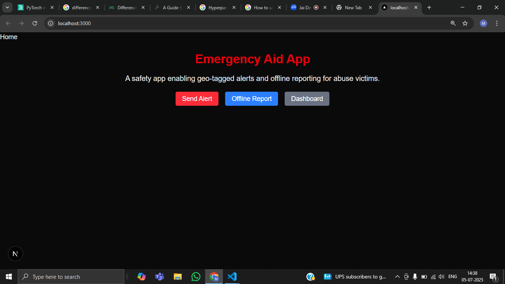
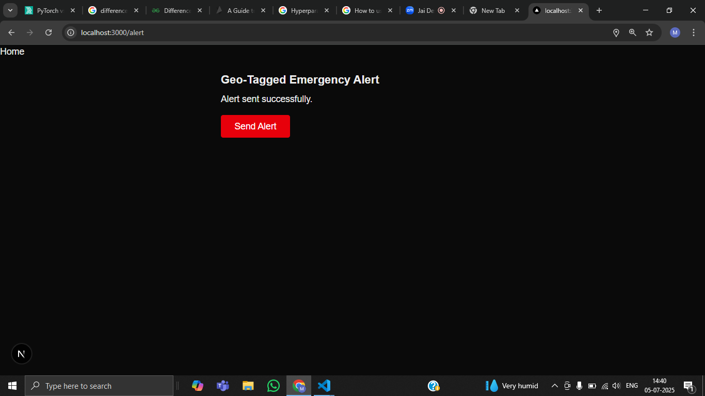

# 🚨 Emergency Aid App

A safety web application enabling **geo-tagged alerts** and **offline reporting** for abuse victims. This app allows users to send their real-time location during emergencies and submit incident reports even when offline.

---

## 🌟 Features

- **Geo-Tagged Emergency Alerts**  
  - Sends user location in emergencies.
  - Displays alert locations on a map.

- **Offline Abuse Report**  
  - Allows users to describe incidents while offline.
  - Saves reports locally and syncs when online.

- **Dashboard**  
  - View geo-tagged alerts on an interactive map.
  - Browse stored offline abuse reports.

---

## 🚀 Screenshots

### Home

### Geo-Tagged Alert Page

### Offline Report Page

### Offline Reports Dashboard

### Geo-Tagged Alerts Map

---

## ⚙️ Tech Stack

- **Frontend:** Next.js
- **Map:** Leaflet + OpenStreetMap
- **Local Storage:** For offline report saving
- **Styling:** Tailwind
- **ORM:** Prisma
